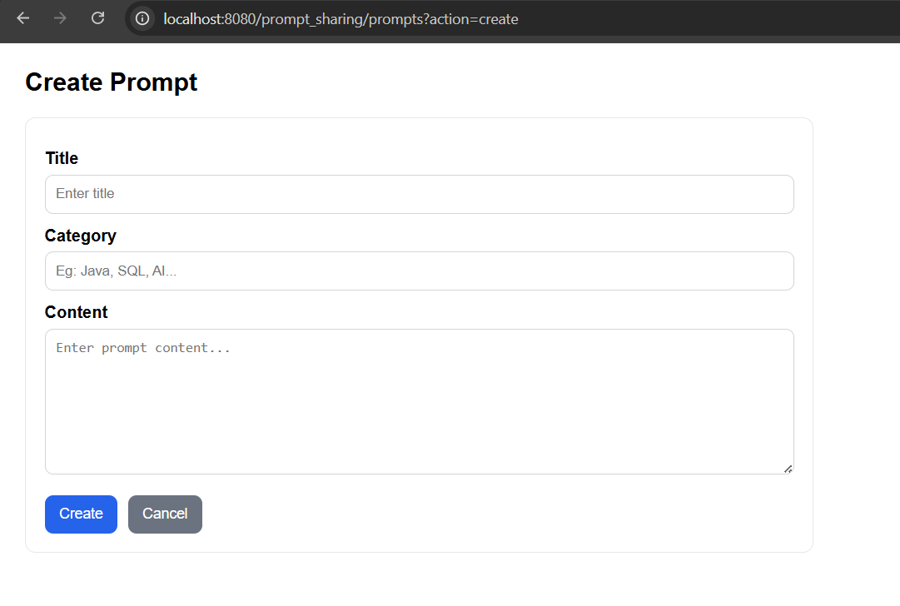
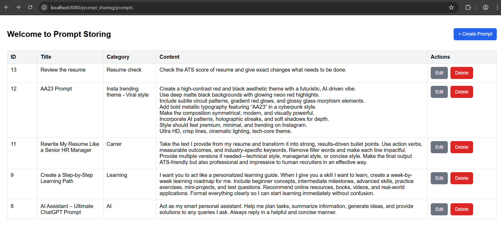
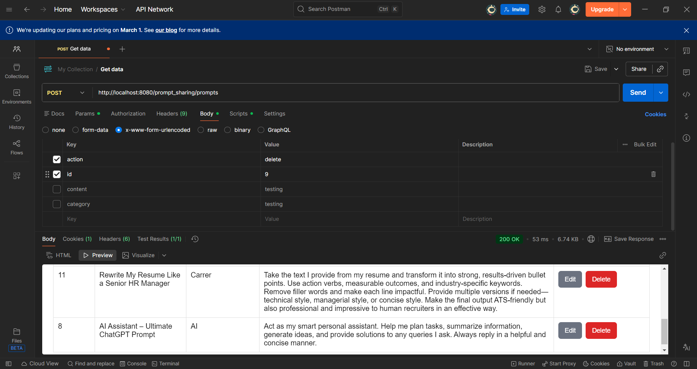

# Prompt Sharing Application

The Prompt Sharing Application is a full-stack Java web project built using *Java Servlets, JSP, JDBC, and MySQL*. It allows users to create, view, update, and delete prompts — similar to a small content-sharing system.

This project follows the MVC (Model–View–Controller) architecture and uses the DAO (Data Access Object) pattern for clean separation of database logic.

# 🔥 Key Features

- 📌 View all prompts in a table  
- ➕ Create a new prompt  
- ✏️ Edit existing prompts  
- ❌ Delete prompts  
- 📂 Categories for organizing prompts  
- 🕒 Automatic timestamp storage  
- ✔ Clean backend architecture using Servlets + DAO + JDBC  

# 🧱 Project Architecture

# 1. Controller Layer (Servlets)
Handles incoming requests:
- HomeServlet → Redirects root URL to /prompts
- PromptPageServlet` → Controls all CRUD actions

# 2. DAO Layer
Handles database operations:
- `PromptDao` → Interface describing CRUD methods
- `PromptDaoJdbc` → JDBC implementation with SQL queries

# 3. Model Layer 
- `Prompt.java` → Represents one prompt (id, title, content, category, createdAt)

# 4. Utility Layer
- `DBUtil.java` → Provides MySQL database connection using JDBC

# 5. View Layer (JSP)
- `index.jsp` → Displays all prompts  
- `create.jsp` → Form to create a new prompt  
- `edit.jsp` → Form to update an existing prompt  

# Create

# Edit

# View

# Delete

